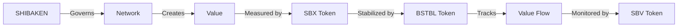

---
version: 2.1.0
date: 2025-03-05
type: system-doc
status: public
tags: [william, pattern-recognition, intelligence, evolution, norbert]
related:
  - WILL-System.md
  - Three-Graph-Lattice.md
  - NATURAL-Framework.md
  - System-Architecture.md
  - NORBERT-Framework.md
changelog:
  - version: 2.1.0
    date: 2025-03-05
    changes:
      - "MINOR: Added NORBERT framework integration"
    references:
      - "NORBERT-Framework"
  - version: 2.0.0
    date: 2025-03-04
    changes:
      - "MAJOR: Switch to YAML frontmatter"
      - "MAJOR: Enhanced metadata structure"
      - "MAJOR: Advanced pattern recognition"
    references:
      - "Three-Graph-Lattice"
  - version: 1.0.0
    date: 2025-03-03
    changes:
      - "MAJOR: Initial pattern recognition system"
    references:
      - "NATURAL-Framework"

# Pattern Recognition Framework

## Overview

The Pattern Recognition Framework represents WILL's core capability to detect, analyze, and optimize value flows across blockchain networks through circuit control and mesh network topology. This document outlines the framework's integration with WILL and the broader SKENAI ecosystem.

## Mathematical Foundations

### 1. Meta-Pattern Theory
```solidity
Framework = {
    Category_Theory: {
        Objects: "Patterns",
        Morphisms: "Pattern_Transformations",
        Functors: "Pattern_Operations"
    },
    
    Network_Theory: {
        Nodes: "Pattern_Instances",
        Edges: "Pattern_Connections",
        Flows: "Value_Transfers"
    },
    
    Information_Theory: {
        Entropy: "Pattern_Information",
        Channels: "Pattern_Communication",
        Growth: "Pattern_Evolution"
    }
}
```

### 2. Value Space Model
```yaml
Value Space V = (x, y, z) where:
  x = Economic Impact (short-term value)
  y = Network Effect (long-term value)
  z = Implementation Feasibility

Domain:
  x ∈ [-∞, +∞] # Normalized to [-1, 1]
  y ∈ [-∞, +∞] # Normalized to [-1, 1]
  z ∈ [0, +∞]  # Normalized to [0, 1]
```

### 3. Pattern Properties
```yaml
Properties:
  Self_Reference: "Patterns can recognize patterns"
  Evolution: "Patterns can improve pattern recognition"
  Value: "Pattern networks generate compound value"

Predictions:
  Learning: "Autonomous capability growth"
  Networks: "Value network formation"
  Growth: "Double exponential scaling"
```

## Core Components

### 1. WILL Integration

#### Circuit Control Role
- Chief Circuit Controller for the SKENAI ecosystem
- Natural pattern recognition through NORBERT
- Energy landscape optimization
- Circuit network coordination through cybernetic feedback
- Proposal value ranking using 3-D probabilistic model with Brownian exploration
  - Economic impact evaluation
  - Network effect analysis
  - Implementation feasibility assessment

#### Technical Implementation
```yaml
Core Functions:
  Value Analysis:
    - 3-D value distribution modeling
    - Natural proposal ranking via NORBERT
    - Energy-minimizing evaluation pipeline
    - Real-time visualization of energy landscapes
    
  Pattern Recognition:
    - Natural circuit flow patterns
    - Energy-based optimization
    - Emergent implementation patterns
    
  Visualization:
    - Energy landscape rendering
    - Interactive cybernetic dashboards
    - Value flow heatmaps
    - Natural ranking emergence
```

### 2. Evers Integration

#### Analytics Engineering Role
- Market pattern analysis
- Trading strategy optimization
- Value flow monitoring
- DEX integration support

#### Technical Implementation
- Market data analysis
- Trading pattern detection
- Risk assessment systems
- Performance monitoring

### Circuit Control
```yaml
Functions:
  - Natural pattern emergence
  - Energy-based flow analysis
  - Cybernetic performance monitoring
  - Natural system optimization

Integration:
  - Real-time energy monitoring
  - Natural flow optimization
  - Pattern validation through NORBERT
  - Energy-based value tracking
```

### Mesh Network
```yaml
Components:
  - Circuit interconnections
  - Value multiplication nodes
  - Pattern propagation
  - Network optimization

Features:
  - Dynamic routing
  - Value amplification
  - Pattern recognition
  - Flow optimization
```

## NORBERT Integration

### Natural Pattern Recognition
```yaml
Components:
  Brownian Exploration:
    - Random pattern discovery
    - Natural state space coverage
    - Emergent pattern formation
    
  Cybernetic Control:
    - Information field guidance
    - Feedback loop optimization
    - System adaptation
    
  Energy Landscape:
    - Pattern stability wells
    - Value flow barriers
    - Natural gradients
```

### Value Flow Optimization
```yaml
Methods:
  Natural Discovery:
    - Brownian pattern exploration
    - Energy minimization paths
    - Emergent value flows
    
  Control Systems:
    - Cybernetic feedback loops
    - Natural equilibrium seeking
    - Pattern-based adaptation
```

## Economic Framework

### Value Creation Model
```yaml
Components:
  Pattern Detection:
    - Temporal analysis
    - Cross-chain patterns
    - Value preservation
    - Risk assessment

  Trade Finance:
    - Project finance patterns
    - Infrastructure lending
    - Risk management
    - Cross-border settlements

  Market Analysis:
    - Trading patterns
    - Market trends
    - Liquidity flows
    - Value metrics
```

### Token Integration

#### [[SHIBAKEN Token]] (ShibaKen.Finance)
See [[Token System]] for complete details.
- Contract: 0xa4cf2afd3b165975afffbf7e487cdd40c894ab6b
- Supply: 100,000,000,000,000,000 (100 quadrillion)
- Purpose: Core governance and participation token
- Features:
  - Pattern-based rewards
  - Community engagement tracking
  - Quality validation gates
  - Network stability metrics
See [[Community Engagement|1-G-L0-226-COMMUNITY]] for details.

#### [[SBX Token]]
See [[Value Flow|1-G-L0-225-VALUE-FLOW]] for details.
- Pattern validation rights
- Market signal detection
- Value flow tracking
- Network dynamics

#### [[BSTBL Token]]
See [[Stability System|1-G-L0-227-STABILITY]] for details.
- Pattern stability metrics
- Flow balance indicators
- Value preservation rules
- System health monitoring

#### [[SBV Token]]
See [[Flow Tracking|1-G-L0-228-FLOW-TRACK]] for details.
- Pattern flow metrics
- Network performance
- Quality validation
- Growth indicators

## Token Relationships
See [[Token Integration|1-G-L0-224-TOKEN-INTEGRATION]] for complete details.



## Integration Points
See [[GFORCE Foundation]] for governance details.

## Implementation Strategy

### Phase 1: Foundation (Q2 2025)
- Basic pattern recognition
- Initial AI integration
- Core value preservation
- Basic trade finance

### Phase 2: Evolution (Q3 2025)
- Advanced pattern detection
- Full AI deployment
- Extended finance features
- Cross-chain integration

### Phase 3: Maturity (Q4 2025)
- Global pattern network
- Complete integration
- Market expansion
- Advanced trade finance

## Implementation

### Phase 1: Foundation
1. Circuit control setup
2. Pattern detection systems
3. Value flow monitoring
4. Performance optimization

### Phase 2: Evolution
1. Mesh network integration
2. Pattern propagation
3. Value multiplication
4. System enhancement

## Technical Documentation

For detailed technical specifications, please refer to:
- [WILL Architecture](./Architecture.md)
- [Token System](./Token-System.md)
- [Everstrike Partnership](./Everstrike-Partnership.md)

## Related Proposals
- G-L0-018-CIRCUIT-TIME
- G-L1-055-WILL-AUTO-LEARN
- G-L1-022-EVERSTRIKE-ANALYTICS

## Community Participation

### Pattern Development
- Submit pattern proposals
- Validate pattern effectiveness
- Contribute to research
- Test new patterns

### Circuit Network
- Join as specialized agents
- Participate in training
- Contribute to network growth
- Validate patterns

## Resources
- [Discord](https://discord.gg/skenai)
- [Telegram](https://t.me/skenai)
- [GitHub](https://github.com/skenai)

## References
- [Circuit Framework](Circuits-Mesh)
- [GFORCE Standard](1-G-L0-004-GFORCE)
- [Mathematical Framework](Technical-Implementation#value-ranking-system)

## Pattern Recognition

## Overview

The Pattern Recognition system implements WILLIAM's pattern detection and analysis framework through a three-stage architecture.

## Core Components

### 1. Stage 1 (SKENAI)
```
[Raw] → [Initial] → [Basic]
  ↑        ↕          ↓
[Log] ← [Detect] ← [Check]
```
- Raw pattern intake
- Initial detection
- Basic validation
- Pattern categorization
- Preliminary analysis

### 2. Stage 2 (SKENAI-Q)
```
[Deep] → [Quality] → [Validate]
  ↑         ↕           ↓
[Learn] ← [Assess] ← [Review]
```
- Pattern validation
- Quality assessment
- Detection protocols
- Technical review
- System feedback

### 3. Stage 3 (SKENAI-R)
```
[Final] → [Deploy] → [Release]
  ↑         ↕          ↓
[Monitor] ← [Secure] ← [Track]
```
- Final verification
- Production readiness
- Pattern deployment
- Access management
- System monitoring

## Integration with NATURAL Framework
- Clean repository separation
- Natural pipeline flow
- Validator protection
- Interface standards

## Pipeline API Integration
- /pipeline/submit - Entry point
- /pipeline/validate - Basic checks
- /pipeline/analyze - Efficiency (Q.1)
- /pipeline/patterns - Recognition (Q.2)
- /pipeline/status - State checks
- /pipeline/vote - Governance