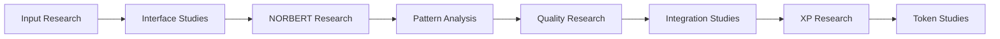

# Technical Implementation Research

> **IMPORTANT RESEARCH NOTICE**: This document outlines a theoretical research project under active development. All architectures, components, and capabilities discussed here are research objectives that require extensive testing and validation. All system designs, interactions, and behaviors are proposed models pending practical implementation.

## Research Architecture

### 1. Core Research Components
```yaml
Frontend Research:
  - Next.js framework studies
  - React component research
  - Edge runtime experiments
  - Update mechanism studies

Backend Research:
  - Node.js service studies
  - Database research models
  - Cache system experiments
  - Integration research

AI Research Systems:
  - Interface research studies
  - Natural system experiments
  - Pattern recognition research
  - Validation methodology
  - Quality assessment studies
```

### 2. Theoretical Data Flow


## Research Database Schema

### 1. XP Research System
```sql
-- Experimental schema requiring validation
CREATE TABLE xp_state (
  user_id TEXT PRIMARY KEY,
  unallocated_xp INTEGER NOT NULL DEFAULT 0,
  allocated_xp INTEGER NOT NULL DEFAULT 0,
  decayed_xp INTEGER NOT NULL DEFAULT 0,
  last_update TIMESTAMP NOT NULL,
  created_at TIMESTAMP NOT NULL DEFAULT CURRENT_TIMESTAMP
);

CREATE TABLE xp_transactions (
  id TEXT PRIMARY KEY,
  user_id TEXT NOT NULL,
  amount INTEGER NOT NULL,
  type TEXT NOT NULL,
  metadata JSONB,
  created_at TIMESTAMP NOT NULL,
  FOREIGN KEY (user_id) REFERENCES xp_state(user_id)
);

CREATE TABLE xp_allocations (
  id TEXT PRIMARY KEY,
  user_id TEXT NOT NULL,
  target_type TEXT NOT NULL,
  target_id TEXT NOT NULL,
  amount INTEGER NOT NULL,
  decay_rate REAL NOT NULL,
  lock_period INTEGER,
  bonus_multiplier REAL,
  created_at TIMESTAMP NOT NULL,
  FOREIGN KEY (user_id) REFERENCES xp_state(user_id)
);
```

### 2. Proposal Research System
```sql
-- Experimental schema requiring validation
CREATE TABLE proposals (
  id TEXT PRIMARY KEY,
  track TEXT NOT NULL,
  level TEXT NOT NULL,
  sequence TEXT NOT NULL,
  name TEXT NOT NULL,
  title TEXT NOT NULL,
  content TEXT NOT NULL,
  status TEXT NOT NULL,
  priority TEXT NOT NULL,
  security_level TEXT NOT NULL,
  quality_metrics JSONB,
  created_at TIMESTAMP NOT NULL,
  updated_at TIMESTAMP NOT NULL
);

CREATE TABLE proposal_requirements (
  id TEXT PRIMARY KEY,
  proposal_id TEXT NOT NULL,
  type TEXT NOT NULL,
  content TEXT NOT NULL,
  status TEXT NOT NULL,
  created_at TIMESTAMP NOT NULL,
  FOREIGN KEY (proposal_id) REFERENCES proposals(id)
);
```

## Research API Framework

### 1. XP Research Management
```typescript
// Experimental interface requiring validation
interface XPResearchSystem {
  // Award XP research method
  awardXP(userId: string, amount: number, metadata: any): Promise<void>;
  
  // Experimental decay process
  processDecay(userId: string): Promise<void>;
  
  // Research allocation method
  allocateXP(userId: string, target: string, amount: number): Promise<void>;
  
  // State research analysis
  getXPState(userId: string): Promise<XPState>;
}
```

### 2. Proposal Research Management
```typescript
// Experimental interface requiring validation
interface ProposalResearchSystem {
  // Research creation method
  createProposal(data: ProposalData): Promise<string>;
  
  // Validation research process
  validateProposal(id: string): Promise<ValidationResult>;
  
  // Status research update
  updateStatus(id: string, status: string): Promise<void>;
  
  // Research data retrieval
  getProposal(id: string): Promise<ProposalData>;
}
```

## Research Value Ranking System

### 1. Three-Dimensional Research Model
```yaml
Research Value Space:
  Theoretical Dimensions:
    x: Economic Impact Studies
    y: Network Effect Research
    z: Implementation Research
  
  Research Normalization:
    x: [-1, 1] # Short-term research
    y: [-1, 1] # Long-term studies
    z: [0, 1]  # Feasibility research
    
  NORBERT Research Integration:
    - Energy landscape studies
    - Value discovery research
    - Feedback control experiments
```

### 2. Research Analysis Framework
```yaml
Research Features:
  - Pattern recognition studies
  - Energy evaluation research
  - Scoring methodology studies
  - Exploration experiments
  - Control system research
```

### 3. Research Evaluation System
```python
class EnergyLandscapeResearch:
    def __init__(self):
        self.topology = {
            'wells': [],      # Research states
            'barriers': [],   # Research costs
            'gradients': []   # Research directions
        }
        self.information = {
            'signals': [],    # Research feedback
            'flows': [],      # Research movements
            'patterns': []    # Research behaviors
        }
```

### 2. Research Agents
```python
class ResearchAgent:
    def step(self):
        # Experimental exploration (70%)
        random_step = self.research_motion()
        
        # Research guidance (30%)
        info_gradient = self.get_research_information()
        
        # Research movement
        return self.research_move(
            random_step * 0.7 +
            info_gradient * 0.3
        )
```

### 3. Research System Control
```python
class ResearchSystem:
    def operate(self):
        while True:
            # Research movement
            self.agents.research_step()
            
            # Research guidance
            self.landscape.update_research()
            
            # Research emergence
            self.study_and_adjust()
```

## Security Research Protocols

### 1. Access Research Control
```yaml
Research Levels:
  PUBLIC_RESEARCH:
    - Read research proposals
    - Submit research proposals
    - View research stats
  
  MEMBER_RESEARCH:
    - Create research proposals
    - Research voting methods
    - Access research resources
    
  ADMIN_RESEARCH:
    - Research level management
    - Validation research
    - Research configuration
```

### 2. Research Data Protection
```yaml
Research Encryption:
  - Transit research (TLS 1.3)
  - Storage research (AES-256)
  - Key research (Vault)

Research Backup:
  - Database research
  - Backup validation
  - Retention studies
```

### 3. Research Rate Limiting
```yaml
Research API Limits:
  Public Research:
    - 100 research requests/hour
    - 1000 research requests/day
  
  Member Research:
    - 1000 research requests/hour
    - 10000 research requests/day
    
  Admin Research:
    - 5000 research requests/hour
    - 50000 research requests/day
```

## Research Implementation Notes

1. **Research Validation Requirements**
   - All components require thorough validation
   - System interactions need extensive testing
   - Performance metrics are theoretical targets
   - Results require scientific verification
   - Integration patterns need testing

2. **Research Methodology**
   - Rigorous scientific approach
   - Theoretical framework validation
   - Experimental testing protocols
   - Performance measurement studies
   - Results verification methods

## Contact Information
- Research Team: [research]
- Development: [dev]
- Documentation: [docs]
- Support: [support]

## A Note to Our Family

While maintaining our rigorous research foundation, we recognize that William's strength comes from bringing people together. As a family-focused business, we:
- Value research integrity
- Share verified insights
- Support each other's growth
- Build trust through honesty
- Win through excellence

Remember: While we operate as a family business, our foundation is built on rigorous research and validation. Every feature and capability represents ongoing research that requires thorough testing before practical implementation.