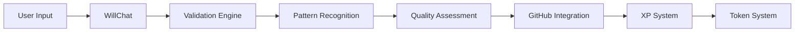

# Technical Implementation

## System Architecture

### 1. Core Components
```yaml
Frontend:
  - Next.js Framework
  - React Components
  - Edge Runtime
  - Real-time Updates

Backend:
  - Node.js Services
  - PostgreSQL Database
  - Redis Cache
  - GitHub API Integration

AI Systems:
  - WILL Chat Interface
  - Pattern Recognition
  - Validation Engine
  - Quality Assessment
```

### 2. Data Flow


## Database Schema

### 1. XP System
```sql
CREATE TABLE xp_state (
  user_id TEXT PRIMARY KEY,
  unallocated_xp INTEGER NOT NULL DEFAULT 0,
  allocated_xp INTEGER NOT NULL DEFAULT 0,
  decayed_xp INTEGER NOT NULL DEFAULT 0,
  last_update TIMESTAMP NOT NULL,
  created_at TIMESTAMP NOT NULL DEFAULT CURRENT_TIMESTAMP
);

CREATE TABLE xp_transactions (
  id TEXT PRIMARY KEY,
  user_id TEXT NOT NULL,
  amount INTEGER NOT NULL,
  type TEXT NOT NULL,
  metadata JSONB,
  created_at TIMESTAMP NOT NULL,
  FOREIGN KEY (user_id) REFERENCES xp_state(user_id)
);

CREATE TABLE xp_allocations (
  id TEXT PRIMARY KEY,
  user_id TEXT NOT NULL,
  target_type TEXT NOT NULL,
  target_id TEXT NOT NULL,
  amount INTEGER NOT NULL,
  decay_rate REAL NOT NULL,
  lock_period INTEGER,
  bonus_multiplier REAL,
  created_at TIMESTAMP NOT NULL,
  FOREIGN KEY (user_id) REFERENCES xp_state(user_id)
);
```

### 2. Proposal System
```sql
CREATE TABLE proposals (
  id TEXT PRIMARY KEY,
  track TEXT NOT NULL,
  level TEXT NOT NULL,
  sequence TEXT NOT NULL,
  name TEXT NOT NULL,
  title TEXT NOT NULL,
  content TEXT NOT NULL,
  status TEXT NOT NULL,
  priority TEXT NOT NULL,
  security_level TEXT NOT NULL,
  quality_metrics JSONB,
  created_at TIMESTAMP NOT NULL,
  updated_at TIMESTAMP NOT NULL
);

CREATE TABLE proposal_requirements (
  id TEXT PRIMARY KEY,
  proposal_id TEXT NOT NULL,
  type TEXT NOT NULL,
  content TEXT NOT NULL,
  status TEXT NOT NULL,
  created_at TIMESTAMP NOT NULL,
  FOREIGN KEY (proposal_id) REFERENCES proposals(id)
);
```

## API Specifications

### 1. XP Management
```typescript
interface XPSystem {
  // Award XP for contributions
  awardXP(userId: string, amount: number, metadata: any): Promise<void>;
  
  // Process weekly decay
  processDecay(userId: string): Promise<void>;
  
  // Allocate XP to tracks/tokens
  allocateXP(userId: string, target: string, amount: number): Promise<void>;
  
  // Get user XP state
  getXPState(userId: string): Promise<XPState>;
}
```

### 2. Proposal Management
```typescript
interface ProposalSystem {
  // Create new proposal
  createProposal(data: ProposalData): Promise<string>;
  
  // Validate proposal
  validateProposal(id: string): Promise<ValidationResult>;
  
  // Update proposal status
  updateStatus(id: string, status: string): Promise<void>;
  
  // Get proposal details
  getProposal(id: string): Promise<ProposalData>;
}
```

## Value Ranking System

### 1. Three-Dimensional Model
```yaml
Value Space:
  Dimensions:
    x: Economic Impact
    y: Network Effect
    z: Implementation Feasibility
  
  Normalization:
    x: [-1, 1] # Short-term value
    y: [-1, 1] # Long-term value
    z: [0, 1]  # Feasibility score
```

### 2. Advanced Analysis
```yaml
Features:
  - Proprietary value analysis
  - Pattern-based evaluation
  - Multi-dimensional scoring
  - Confidence intervals
```

### 3. Automated Evaluation
```yaml
Pipeline:
  1. Input Processing:
     - Extract metrics
     - Normalize values
     - Calculate correlations
  
  2. Value Analysis:
     - Economic impact
     - Network effects
     - Implementation risk
  
  3. Ranking:
     - Apply algorithms
     - Generate score
     - Provide recommendation
```

## Security Protocols

### 1. Access Control
```yaml
Levels:
  PUBLIC:
    - Read public proposals
    - Submit basic proposals
    - View community stats
  
  MEMBER:
    - Create any proposal
    - Vote on proposals
    - Access member resources
    
  ADMIN:
    - Manage security levels
    - Override validations
    - System configuration
```

### 2. Data Protection
```yaml
Encryption:
  - All data in transit (TLS 1.3)
  - Sensitive data at rest (AES-256)
  - API keys and secrets (Vault)

Backup:
  - Daily database snapshots
  - Weekly full backups
  - 30-day retention
```

### 3. Rate Limiting
```yaml
API Limits:
  Public:
    - 100 requests/hour
    - 1000 requests/day
  
  Member:
    - 1000 requests/hour
    - 10000 requests/day
    
  Admin:
    - 5000 requests/hour
    - 50000 requests/day
```

## Performance Optimization

### 1. Caching Strategy
```yaml
Redis Cache:
  - XP states (5 minutes)
  - Proposal metadata (15 minutes)
  - User profiles (30 minutes)
  - System stats (1 hour)

Edge Caching:
  - Static assets (1 week)
  - API responses (1 minute)
  - Documentation (1 day)
```

### 2. Database Indexing
```sql
-- XP System Indexes
CREATE INDEX idx_xp_transactions_user_id ON xp_transactions(user_id);
CREATE INDEX idx_xp_transactions_type ON xp_transactions(type);
CREATE INDEX idx_xp_allocations_user_target ON xp_allocations(user_id, target_type);

-- Proposal System Indexes
CREATE INDEX idx_proposals_track_level ON proposals(track, level);
CREATE INDEX idx_proposals_status ON proposals(status);
CREATE INDEX idx_proposal_requirements_proposal ON proposal_requirements(proposal_id);
```

## Deployment Pipeline

### 1. Environment Setup
```yaml
Development:
  - Local development
  - Unit testing
  - Integration testing

Staging:
  - Feature validation
  - Performance testing
  - Security scanning

Production:
  - Blue-green deployment
  - Automated rollback
  - Health monitoring
```

### 2. CI/CD Flow
```yaml
Steps:
  1. Code Push:
     - Lint checks
     - Unit tests
     - Build validation
  
  2. Pull Request:
     - Integration tests
     - Security scan
     - Performance check
  
  3. Merge:
     - Staging deployment
     - E2E testing
     - Load testing
  
  4. Release:
     - Production deployment
     - Health checks
     - Monitoring alerts
```

## Monitoring and Alerts

### 1. System Metrics
```yaml
Performance:
  - Response times
  - Error rates
  - Resource usage
  - Cache hit rates

Health:
  - API availability
  - Database connections
  - Queue lengths
  - Memory usage
```

### 2. Alert Thresholds
```yaml
Critical:
  - 5xx errors > 1%
  - Response time > 2s
  - CPU usage > 80%
  - Memory usage > 90%

Warning:
  - 4xx errors > 5%
  - Response time > 1s
  - CPU usage > 60%
  - Memory usage > 70%
```

## Related Documentation
- [API Documentation](API-Documentation)
- [Security and Testing](Security-and-Testing)
- [Edge Runtime](Edge-Runtime)
- [WillChat Component](WillChat-Component)


## Integration with NATURAL Framework
- Clean repository separation
- Natural pipeline flow
- Validator protection
- Interface standards

## Pipeline API Integration
- /pipeline/submit - Entry point
- /pipeline/validate - Basic checks
- /pipeline/analyze - Efficiency (Q.1)
- /pipeline/patterns - Recognition (Q.2)
- /pipeline/status - State checks
- /pipeline/vote - Governance

## Integration with Three-Graph Lattice
- Technical graph validation
- Economic resource optimization
- Quality metrics tracking