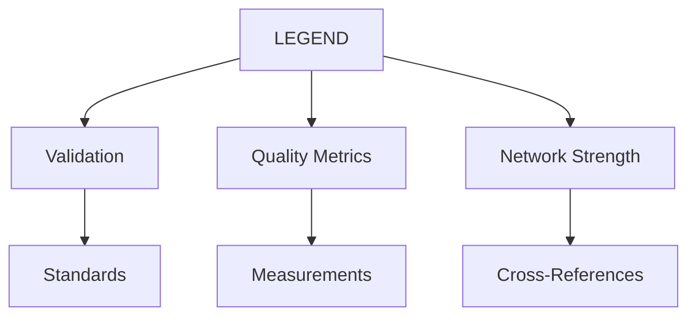
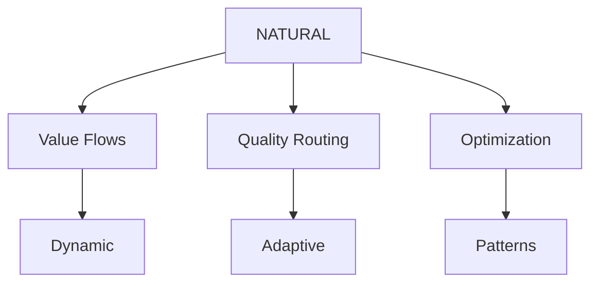
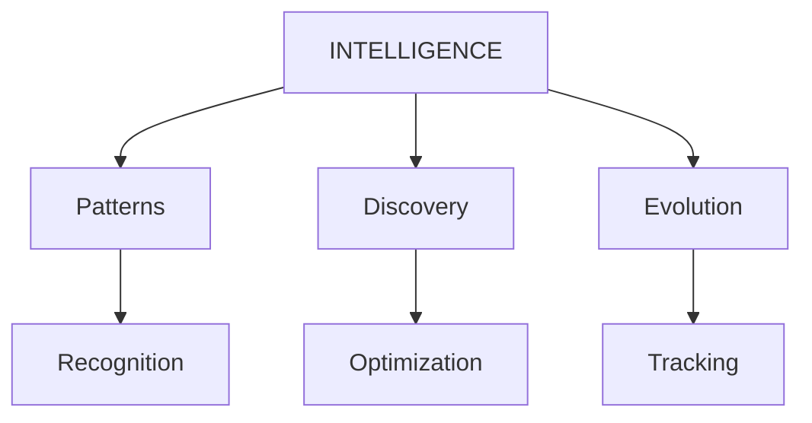

# Three-Graph Lattice Network

## Overview
The Three-Graph Lattice Network represents a major evolution in WILL's architecture, integrating technical validation, economic flows, and quality assessment into a unified system.

## Core Graphs

### 1. Technical Graph (LEGEND)


- **Role**: Standards enforcement and validation
- **Version**: 2.0.0
- **Status**: ACTIVE
- **Integration Points**: 
  * NATURAL (Economic validation)
  * INTELLIGENCE (Pattern verification)

### 2. Economic Graph (NATURAL)


- **Role**: Value flow management
- **Version**: 1.0.0
- **Status**: ACTIVE
- **Integration Points**:
  * AIQ (Quality measurement)
  * TOKENOMICS (Economic system)

### 3. Quality Graph (INTELLIGENCE)


- **Role**: Pattern recognition and optimization
- **Version**: 1.1.0
- **Status**: ACTIVE
- **Integration Points**:
  * BRAIN (Intelligence infrastructure)
  * AIQ (Quality enhancement)

## Cross-Graph Communication

### 1. Interfaces
```typescript
interface IGraphCommunication {
    validateWithLegend(): boolean;
    optimizeWithNatural(): boolean;
    enhanceWithIntelligence(): boolean;
}
```

### 2. Value Flow Protocols
```typescript
interface IValueFlow {
    routeValue(source: bytes32, target: bytes32): boolean;
    optimizeRoute(path: bytes32[]): bytes32[];
    measureQuality(node: bytes32): uint256;
}
```

### 3. Pattern Recognition APIs
```typescript
interface IPatternRecognition {
    detectPattern(graphId: bytes32): bytes32;
    validatePattern(patternId: bytes32): boolean;
    optimizePattern(patternId: bytes32): uint256;
}
```

## Implementation Status
- **Deployment Date**: 2025-02-25
- **Bundle**: 20250225_141221
- **Network Strength**: 900+
- **Quality Metrics**: All components 800+

## Next Steps
1. Pattern optimization enhancements
2. Cross-graph routing improvements
3. Network strength calculations
4. Quality metric refinements

## Three-Graph Lattice

The Three-Graph Lattice is a core component of WILL v2.0.0, enabling sophisticated pattern recognition and cross-domain optimization.

## Graph Components

### 1. Technical Graph (LEGEND)
- Tracks technical validations
- Monitors code quality
- Manages dependencies
- Ensures security compliance

### 2. Economic Graph
- Tracks value flow
- Monitors resource usage
- Optimizes allocation
- Manages incentives

### 3. Quality Graph
- Measures pattern quality
- Tracks validator reputation
- Monitors system health
- Ensures consistency

## Cross-Graph Communication

### Pattern Flow
```
Technical -> Economic -> Quality
     ↑          ↑          ↑
     └──────────┴──────────┘
```

### Integration Points
1. Technical Economic
   - Resource optimization
   - Cost-benefit analysis
   - Performance metrics

2. Economic Quality
   - Value validation
   - Resource efficiency
   - Pattern ROI

3. Quality Technical
   - Code quality metrics
   - Pattern validation
   - Security checks

## Implementation

### 1. Setup
```python
from will.lattice import ThreeGraphLattice

lattice = ThreeGraphLattice()
lattice.initialize_graphs()
```

### 2. Pattern Registration
```python
pattern = {
    "technical": technical_data,
    "economic": economic_data,
    "quality": quality_metrics
}
lattice.register_pattern(pattern)
```

### 3. Cross-Graph Analysis
```python
analysis = lattice.analyze_pattern(pattern_id)
optimization = lattice.optimize_resources(analysis)
```

## Best Practices

1. Always validate across all three graphs
2. Monitor cross-graph patterns
3. Optimize for overall system health
4. Maintain graph independence
5. Regular health checks

## Integration with NATURAL Framework

The Three-Graph Lattice integrates with the NATURAL Framework through:
1. Clean repository separation
2. Natural pipeline flow
3. Validator protection
4. Interface standards

## Version Notes
- Introduced in v2.0.0
- Required for all new implementations
- [Migration Guide](versions/MIGRATION-1.0.0-to-2.0.0)

## Pipeline API Integration
- /pipeline/submit - Entry point
- /pipeline/validate - Basic checks
- /pipeline/analyze - Efficiency (Q.1)
- /pipeline/patterns - Recognition (Q.2)
- /pipeline/status - State checks
- /pipeline/vote - Governance