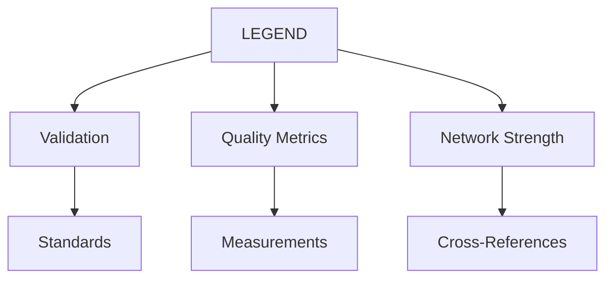
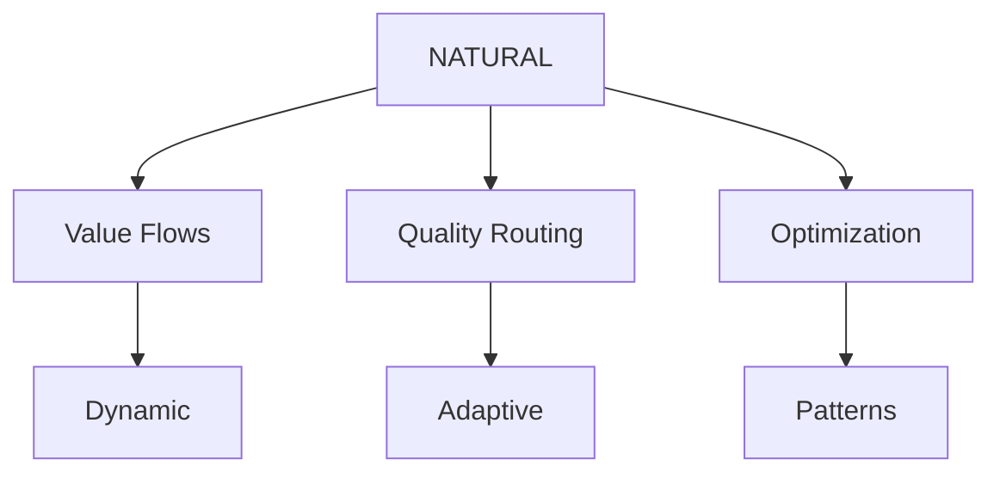
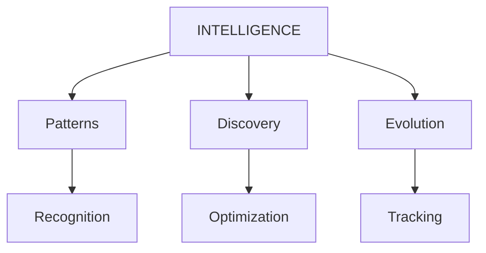

# Three-Graph Lattice Network

## Overview
The Three-Graph Lattice Network represents a major evolution in WILL's architecture, integrating technical validation, economic flows, and quality assessment into a unified system.

## Core Graphs

### 1. Technical Graph (LEGEND)


- **Role**: Standards enforcement and validation
- **Version**: 2.0.0
- **Status**: ACTIVE
- **Integration Points**: 
  * NATURAL (Economic validation)
  * INTELLIGENCE (Pattern verification)

### 2. Economic Graph (NATURAL)


- **Role**: Value flow management
- **Version**: 1.0.0
- **Status**: ACTIVE
- **Integration Points**:
  * AIQ (Quality measurement)
  * TOKENOMICS (Economic system)

### 3. Quality Graph (INTELLIGENCE)


- **Role**: Pattern recognition and optimization
- **Version**: 1.1.0
- **Status**: ACTIVE
- **Integration Points**:
  * BRAIN (Intelligence infrastructure)
  * AIQ (Quality enhancement)

## Cross-Graph Communication

### 1. Interfaces
```typescript
interface IGraphCommunication {
    validateWithLegend(): boolean;
    optimizeWithNatural(): boolean;
    enhanceWithIntelligence(): boolean;
}
```

### 2. Value Flow Protocols
```typescript
interface IValueFlow {
    routeValue(source: bytes32, target: bytes32): boolean;
    optimizeRoute(path: bytes32[]): bytes32[];
    measureQuality(node: bytes32): uint256;
}
```

### 3. Pattern Recognition APIs
```typescript
interface IPatternRecognition {
    detectPattern(graphId: bytes32): bytes32;
    validatePattern(patternId: bytes32): boolean;
    optimizePattern(patternId: bytes32): uint256;
}
```

## Implementation Status
- **Deployment Date**: 2025-02-25
- **Bundle**: 20250225_141221
- **Network Strength**: 900+
- **Quality Metrics**: All components 800+

## Next Steps
1. Pattern optimization enhancements
2. Cross-graph routing improvements
3. Network strength calculations
4. Quality metric refinements


## Integration with NATURAL Framework
- Clean repository separation
- Natural pipeline flow
- Validator protection
- Interface standards

## Pipeline API Integration
- /pipeline/submit - Entry point
- /pipeline/validate - Basic checks
- /pipeline/analyze - Efficiency (Q.1)
- /pipeline/patterns - Recognition (Q.2)
- /pipeline/status - State checks
- /pipeline/vote - Governance