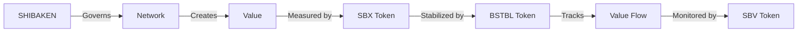

# Pattern Recognition Framework

> **IMPORTANT RESEARCH NOTICE**: The Pattern Recognition Framework represents a theoretical research project under active development. All features, metrics, and capabilities discussed in this documentation are research objectives that require extensive testing and validation. All pattern detection, analysis methods, and system behaviors are proposed models pending practical implementation.

## Research Overview

The Pattern Recognition Framework investigates theoretical approaches for detecting, analyzing, and optimizing value flows across blockchain networks through experimental circuit control and mesh network topology research. This document outlines the framework's theoretical integration with WILL and the broader SKENAI research ecosystem.

## Theoretical Mathematical Foundations

### 1. Meta-Pattern Research Theory
```solidity
// Theoretical Framework Implementation
Framework = {
    Category_Theory: {
        Objects: "Experimental_Patterns",
        Morphisms: "Theoretical_Pattern_Transformations",
        Functors: "Research_Pattern_Operations"
    },
    
    Network_Theory: {
        Nodes: "Research_Pattern_Instances",
        Edges: "Experimental_Pattern_Connections",
        Flows: "Theoretical_Value_Transfers"
    },
    
    Information_Theory: {
        Entropy: "Research_Pattern_Information",
        Channels: "Experimental_Pattern_Communication",
        Growth: "Theoretical_Pattern_Evolution"
    }
}
```

### 2. Theoretical Value Space Model
```yaml
# Research Value Space Model
Value Space V = (x, y, z) where:
  x = Economic Impact (theoretical short-term value)
  y = Network Effect (experimental long-term value)
  z = Implementation Feasibility (research metric)

Research Domain:
  x ∈ [-∞, +∞] # Theoretical normalization to [-1, 1]
  y ∈ [-∞, +∞] # Experimental normalization to [-1, 1]
  z ∈ [0, +∞]  # Research normalization to [0, 1]
```

### 3. Theoretical Pattern Properties
```yaml
Research Properties:
  Self_Reference: "Experimental pattern recognition studies"
  Evolution: "Theoretical pattern improvement research"
  Value: "Research into network value generation"

Research Predictions:
  Learning: "Theoretical capability growth studies"
  Networks: "Experimental value network formation"
  Growth: "Theoretical scaling research"
```

## Research Components

### 1. WILL Research Integration

#### Experimental Circuit Control Role
- Theoretical Circuit Controller for SKENAI ecosystem
- Experimental pattern recognition through NORBERT
- Research-based energy landscape optimization
- Theoretical circuit network coordination
- Experimental proposal value ranking using:
  - Theoretical economic impact studies
  - Experimental network effect analysis
  - Research-based feasibility assessment

#### Research Implementation
```yaml
Experimental Functions:
  Value Analysis Research:
    - Theoretical 3-D value distribution
    - Experimental proposal ranking
    - Research-based evaluation pipeline
    - Theoretical energy landscape visualization
    
  Pattern Recognition Research:
    - Experimental circuit flow patterns
    - Theoretical energy optimization
    - Research-based implementation patterns
    
  Visualization Research:
    - Theoretical landscape rendering
    - Experimental cybernetic dashboards
    - Research-based flow heatmaps
    - Theoretical ranking studies
```

### 2. Evers Research Integration

#### Analytics Research Role
- Market pattern research
- Trading strategy experiments
- Value flow studies
- DEX integration research

#### Research Implementation
- Market data analysis studies
- Trading pattern research
- Risk assessment experiments
- Performance research methods

### Circuit Control Research
```yaml
Experimental Functions:
  - Theoretical pattern emergence
  - Research-based flow analysis
  - Experimental performance monitoring
  - Theoretical system optimization

Research Integration:
  - Experimental energy monitoring
  - Theoretical flow optimization
  - Research-based pattern validation
  - Experimental value tracking
```

### Mesh Network Research
```yaml
Research Components:
  - Theoretical circuit interconnections
  - Experimental value multiplication
  - Research-based pattern propagation
  - Theoretical network optimization

Experimental Features:
  - Research-based routing
  - Theoretical value amplification
  - Experimental pattern recognition
  - Research-based flow optimization
```

## Research Implementation Notes

1. All pattern recognition methods require validation
2. Mathematical models need thorough testing
3. Integration approaches are experimental
4. Performance metrics need verification
5. System behaviors require extensive testing

## NORBERT Research Integration

### Experimental Pattern Recognition
```yaml
Research Components:
  Theoretical Exploration:
    - Experimental pattern discovery
    - Research-based state space coverage
    - Theoretical pattern formation
    
  Experimental Control:
    - Research-based field guidance
    - Theoretical feedback optimization
    - Experimental system adaptation
    
  Research Energy Landscape:
    - Theoretical stability studies
    - Experimental flow barriers
    - Research-based gradients
```

### Value Flow Research
```yaml
Experimental Methods:
  Research Discovery:
    - Theoretical pattern exploration
    - Experimental energy minimization
    - Research-based value flows
    
  Control Research:
    - Theoretical feedback systems
    - Experimental equilibrium studies
    - Research-based adaptation
```

## Core Components

### 1. WILL Integration

#### Circuit Control Role
- Chief Circuit Controller for the SKENAI ecosystem
- Natural pattern recognition through NORBERT
- Energy landscape optimization
- Circuit network coordination through cybernetic feedback
- Proposal value ranking using 3-D probabilistic model with Brownian exploration
  - Economic impact evaluation
  - Network effect analysis
  - Implementation feasibility assessment

#### Technical Implementation
```yaml
Core Functions:
  Value Analysis:
    - 3-D value distribution modeling
    - Natural proposal ranking via NORBERT
    - Energy-minimizing evaluation pipeline
    - Real-time visualization of energy landscapes
    
  Pattern Recognition:
    - Natural circuit flow patterns
    - Energy-based optimization
    - Emergent implementation patterns
    
  Visualization:
    - Energy landscape rendering
    - Interactive cybernetic dashboards
    - Value flow heatmaps
    - Natural ranking emergence
```

### 2. Evers Integration

#### Analytics Engineering Role
- Market pattern analysis
- Trading strategy optimization
- Value flow monitoring
- DEX integration support

#### Technical Implementation
- Market data analysis
- Trading pattern detection
- Risk assessment systems
- Performance monitoring

### Circuit Control
```yaml
Functions:
  - Natural pattern emergence
  - Energy-based flow analysis
  - Cybernetic performance monitoring
  - Natural system optimization

Integration:
  - Real-time energy monitoring
  - Natural flow optimization
  - Pattern validation through NORBERT
  - Energy-based value tracking
```

### Mesh Network
```yaml
Components:
  - Circuit interconnections
  - Value multiplication nodes
  - Pattern propagation
  - Network optimization

Features:
  - Dynamic routing
  - Value amplification
  - Pattern recognition
  - Flow optimization
```

## Economic Research Framework

### Value Creation Research Model
```yaml
Research Components:
  Pattern Detection Studies:
    - Temporal analysis research
    - Cross-chain pattern studies
    - Value preservation research
    - Risk assessment validation

  Trade Finance Research:
    - Project finance pattern studies
    - Infrastructure research framework
    - Risk management validation
    - Settlement research methods

  Market Analysis Research:
    - Trading pattern studies
    - Market trend research
    - Liquidity flow analysis
    - Value metrics validation
```

### Token Research Integration

#### SHIBAK Token Research
- Pattern staking research
- Value preservation studies
- Circuit incentive analysis
- Collateral research model
- Implementation validation

#### SBX Token Research
- Pattern validation studies
- Governance research model
- Value capture analysis
- Approval rights research
- Implementation validation

## Research Implementation Strategy

### Phase 1: Foundation Research (Q2 2025)
- Pattern recognition studies
- AI integration research
- Value preservation analysis
- Trade finance experiments
- Implementation validation

### Phase 2: Evolution Research (Q3 2025)
- Pattern detection studies
- AI deployment research
- Finance feature analysis
- Integration experiments
- Implementation validation

<<<<<<< HEAD
### Phase 3: Maturity Research (Q4 2025)
- Pattern network studies
- Integration research
- Market expansion analysis
- Trade finance experiments
- Implementation validation

## Research Implementation Framework
=======
#### [[SHIBAKEN Token]] (ShibaKen.Finance)
See [[Token System]] for complete details.
- Contract: 0xa4cf2afd3b165975afffbf7e487cdd40c894ab6b
- Supply: 100,000,000,000,000,000 (100 quadrillion)
- Purpose: Core governance and participation token
- Features:
  - Pattern-based rewards
  - Community engagement tracking
  - Quality validation gates
  - Network stability metrics
See [[Community Engagement|1-G-L0-226-COMMUNITY]] for details.

#### [[SBX Token]]
See [[Value Flow|1-G-L0-225-VALUE-FLOW]] for details.
- Pattern validation rights
- Market signal detection
- Value flow tracking
- Network dynamics

#### [[BSTBL Token]]
See [[Stability System|1-G-L0-227-STABILITY]] for details.
- Pattern stability metrics
- Flow balance indicators
- Value preservation rules
- System health monitoring

#### [[SBV Token]]
See [[Flow Tracking|1-G-L0-228-FLOW-TRACK]] for details.
- Pattern flow metrics
- Network performance
- Quality validation
- Growth indicators

## Token Relationships
See [[Token Integration|1-G-L0-224-TOKEN-INTEGRATION]] for complete details.



## Integration Points
See [[GFORCE Foundation]] for governance details.
>>>>>>> 5db85bfdbd578538fdb102ced96e10bcd467cf72

### Phase 1: Foundation Research
1. Circuit control research
2. Pattern detection studies
3. Value flow analysis
4. Performance research
5. Implementation validation

### Phase 2: Evolution Research
1. Network integration studies
2. Pattern research framework
3. Value research methods
4. System analysis model
5. Implementation validation

## Research Documentation
- [Research Architecture](./Architecture.md)
- [Token Research](./Token-System.md)
- [Partnership Research](./Everstrike-Partnership.md)

## Research Proposals
- G-L0-018-CIRCUIT-TIME (Research Implementation)

## Contact Information
- Research Team: [research]
- Development: [dev]
- Documentation: [docs]
- Support: [support]

## A Note to Our Family

While maintaining our rigorous research foundation, we recognize that William's strength comes from bringing people together. As a family-focused business, we:
- Value research integrity
- Share verified insights
- Support each other's growth
- Build trust through honesty
- Win through excellence

Remember: While we operate as a family business, our foundation is built on rigorous research and validation. Every feature and capability represents ongoing research that requires thorough testing before practical implementation.