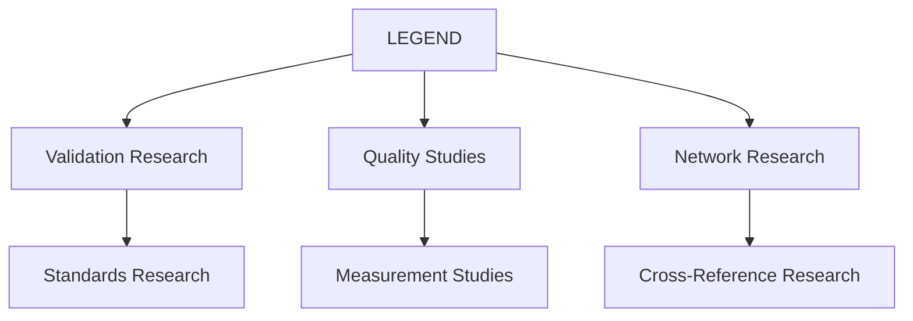
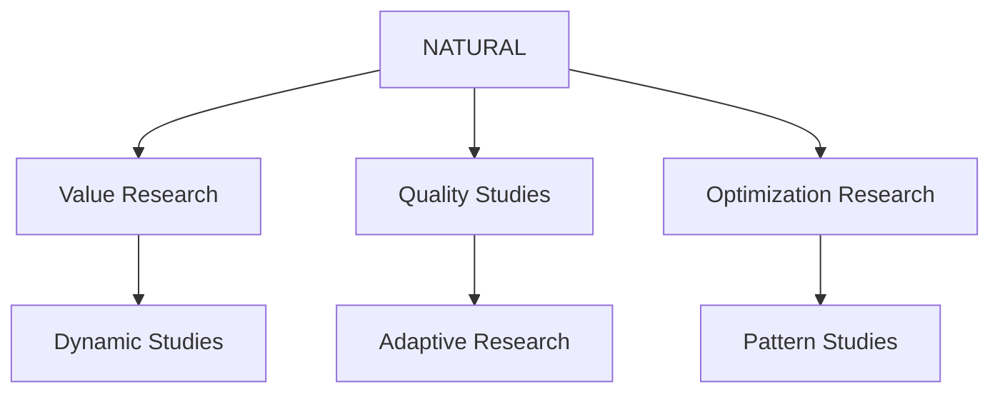
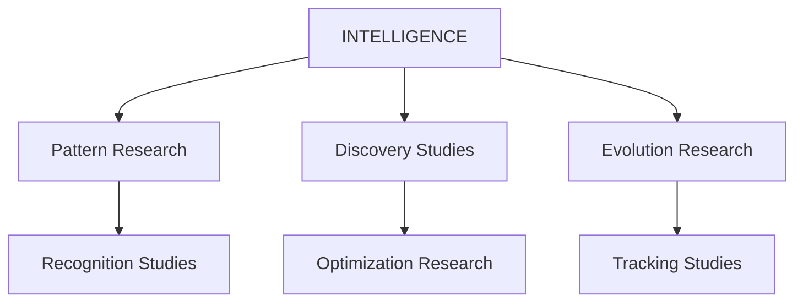

# Three-Graph Lattice Network Research

> **IMPORTANT RESEARCH NOTICE**: This document outlines a theoretical research project under active development. All architectures, components, and capabilities discussed here are research objectives that require extensive testing and validation. All system designs, interactions, and behaviors are proposed models pending practical implementation.

## Research Overview
The Three-Graph Lattice Network represents our theoretical investigation into WILL's architectural evolution, exploring the integration of technical validation studies, economic flow research, and quality assessment methodology into a unified research system.

## Core Research Graphs

### 1. Technical Graph Research (LEGEND)


- **Research Role**: Standards validation methodology
- **Version**: 2.1.0
- **Status**: THEORETICAL
- **Research Integration**:
  * NATURAL (Economic validation studies)
  * INTELLIGENCE (Pattern verification research)

### 2. Economic Graph Research (NATURAL)


- **Research Role**: Value flow methodology
- **Version**: 2.1.0
- **Status**: THEORETICAL
- **Research Integration**:
  * AIQ (Quality measurement studies)
  * TOKENOMICS (Economic system research)

### 3. Quality Graph Research (INTELLIGENCE)


- **Research Role**: Pattern recognition methodology
- **Version**: 2.1.0
- **Status**: THEORETICAL
- **Research Integration**:
  * BRAIN (Intelligence research)
  * AIQ (Quality enhancement studies)

## Research Communication Framework

### 1. Interface Research
```typescript
// Research Notice: These interfaces represent theoretical models
// requiring thorough validation before practical implementation
interface IGraphCommunication {
    validateWithLegend(): boolean;    // Research validation
    optimizeWithNatural(): boolean;   // Research optimization
    enhanceWithIntelligence(): boolean; // Research enhancement
}
```

### 2. Value Flow Research
```typescript
// Research Notice: These interfaces represent theoretical models
// requiring thorough validation before practical implementation
interface IValueFlow {
    routeValue(source: bytes32, target: bytes32): boolean;  // Research routing
    optimizeRoute(path: bytes32[]): bytes32[];              // Research optimization
    measureQuality(node: bytes32): uint256;                 // Research measurement
}
```

### 3. Pattern Recognition Research
```typescript
// Research Notice: These interfaces represent theoretical models
// requiring thorough validation before practical implementation
interface IPatternRecognition {
    detectPattern(graphId: bytes32): bytes32;           // Research detection
    validatePattern(patternId: bytes32): boolean;       // Research validation
    optimizePattern(patternId: bytes32): uint256;       // Research optimization
}
```

## Research Status
- **Research Phase**: Active Development
- **Research Bundle**: 20250316_141221
- **Network Research**: 900+ theoretical targets
- **Quality Studies**: All components theoretical 800+

## Research Directions
1. Pattern optimization methodology
2. Cross-graph routing studies
3. Network strength research
4. Quality metric experiments

## Three-Graph Lattice Research

The Three-Graph Lattice represents a theoretical research component of WILL v2.1.0, investigating sophisticated pattern recognition methodology and cross-domain optimization research.

## Graph Research Components

### 1. Technical Graph Research (LEGEND)
- Technical validation studies
- Code quality research
- Dependency management methodology
- Security compliance experiments

### 2. Economic Graph Research
- Value flow studies
- Resource usage research
- Allocation optimization methodology
- Incentive management experiments

### 3. Quality Graph Research
- Pattern quality studies
- Reputation research methodology
- System health experiments
- Consistency validation research

## Cross-Graph Research Communication

### Pattern Flow Research
```
Technical Research -> Economic Studies -> Quality Research
        ↑                    ↑                    ↑
        └──────────────────────────────────────────┘
```

### Research Integration Points
1. Technical-Economic Research
   - Resource optimization studies
   - Cost-benefit methodology
   - Performance metric research

2. Economic-Quality Research
   - Value validation studies
   - Resource efficiency methodology
   - Pattern ROI experiments

3. Quality-Technical Research
   - Code quality studies
   - Pattern validation methodology
   - Security research experiments

## Research Implementation

### 1. Research Setup
```python
# Research Notice: This code represents a theoretical model
# requiring thorough validation before practical implementation
from will.lattice import ThreeGraphLattice

lattice = ThreeGraphLattice()
lattice.initialize_research()
```

### 2. Pattern Research
```python
# Research Notice: This code represents a theoretical model
# requiring thorough validation before practical implementation
pattern = {
    "technical": technical_research,
    "economic": economic_studies,
    "quality": quality_experiments
}
lattice.research_pattern(pattern)
```

### 3. Cross-Graph Research
```python
# Research Notice: This code represents a theoretical model
# requiring thorough validation before practical implementation
analysis = lattice.analyze_research(pattern_id)
optimization = lattice.optimize_studies(analysis)
```

## Research Best Practices

1. Validate across all research graphs
2. Monitor cross-graph research patterns
3. Optimize for research system health
4. Maintain graph research independence
5. Regular research validation

## Research Integration Framework
- Repository separation methodology
- Pipeline flow research
- Validator protection studies
- Interface standards experiments

## Pipeline Research API
- /pipeline/submit - Research entry point
- /pipeline/validate - Research validation
- /pipeline/analyze - Efficiency studies
- /pipeline/patterns - Recognition research
- /pipeline/status - State monitoring
- /pipeline/vote - Governance research

## Research Contact Information
- Research Team: [research]
- Development: [dev]
- Documentation: [docs]
- Support: [support]

## Research Implementation Notes
1. All components require validation
2. System interactions need testing
3. Performance metrics are theoretical
4. Results require verification
5. Integration needs validation

## A Note to Our Family

While maintaining our rigorous research foundation, we recognize that William's strength comes from bringing people together. As a family-focused business, we:
- Value research integrity
- Share verified insights
- Support each other's growth
- Build trust through honesty
- Win through excellence

Remember: While we operate as a family business, our foundation is built on rigorous research and validation. Every feature and capability represents ongoing research that requires thorough testing before practical implementation.